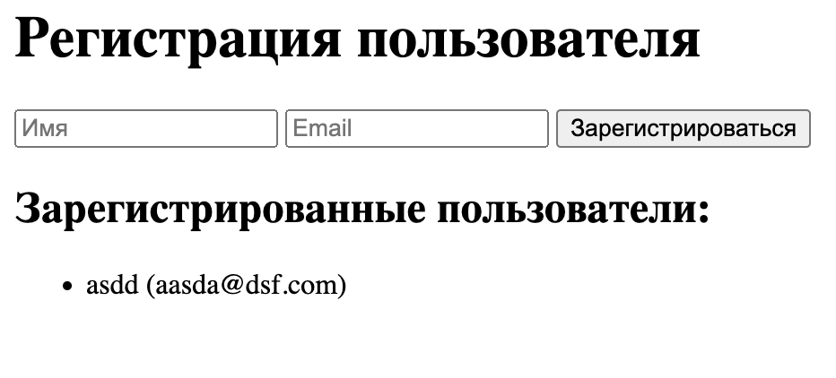

форма html, ts, express + клиент

📌 Без фреймворков,
🟦 TypeScript,
📝 Форма регистрации (имя + email),
📤 Отправка данных на POST /api/register,
📥 Получение списка пользователей с GET /api/users,
📄 И всё отображается на одной странице.

